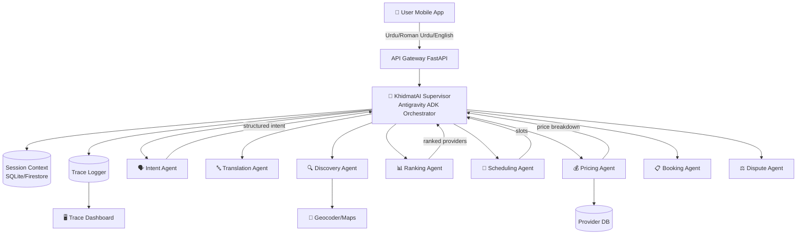
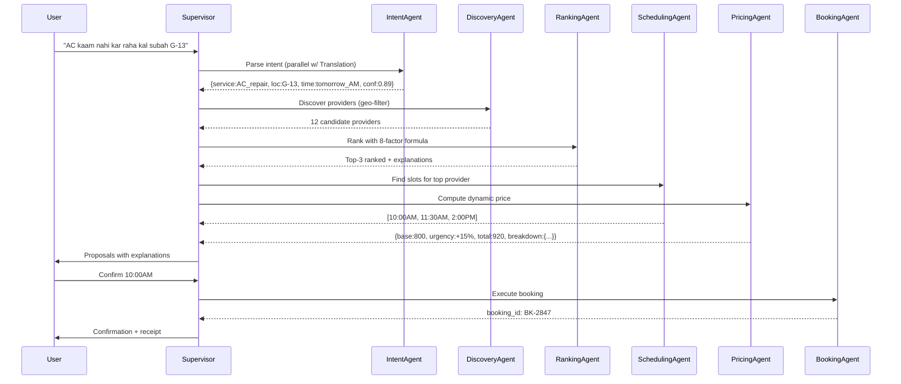

# KhidmatAI — AI Service Orchestrator: Implementation Plan

## Overview

**KhidmatAI** (خدمت AI) is a production-grade, hackathon-winning AI Service Orchestrator for Pakistan's informal economy. It enables users speaking Urdu, Roman Urdu, English, or code-switched variants to book plumbers, electricians, tutors, drivers, and other informal service providers via a robust agentic pipeline built on **Google ADK (Agent Development Kit)** as the Antigravity orchestrator.

The system demonstrates: multilingual robustness, explainable multi-factor matching, intelligent scheduling, dynamic pricing, autonomous dispute recovery, and full trace observability — all demo-ready in 72 hours.

---

## User Review Required

> [!IMPORTANT]
> **Technology Choices Needing Confirmation**
> - **Frontend**: Plan is a **React + Vite web dashboard** (fully interactive, mobile-responsive) + **Flutter screens as static mockups** (HTML/CSS pixel-perfect Flutter-style cards). Full Flutter app would require Android Studio/Dart setup which takes significant time. Should we do React web app only (faster, more polish), or do you want actual Flutter code?
> - **LLM Backend**: Using **Google Gemini 2.0 Flash** via `google-generativeai` SDK. Do you have a Gemini API key ready, or should we build with full mock/simulation mode (no real API calls needed for demo)?
> - **ADK Version**: Using the latest `google-adk` Python package. The orchestration will be demonstrable via Python CLI + web trace dashboard. Is that acceptable for the hackathon demo?
> - **Database**: Plan uses **Firestore** for real-time + **SQLite** locally for the demo (avoids GCP setup time). Should we wire up actual Firestore, or keep SQLite for hackathon speed?

> [!WARNING]
> **Scope Management**: The full spec is enormous. The plan below covers everything but prioritizes the **demo-critical path** first, then adds polish layers. All 25 sections of the spec will be covered but some (e.g., Locust stress tests, BigQuery analytics) will be stubs with realistic data — this is standard hackathon practice.

---

## Open Questions

> [!IMPORTANT]
> 1. Do you have a **Google Cloud / Gemini API key** available to wire in real LLM calls?
> 2. Should the **mobile app** be actual Flutter Dart code, or pixel-perfect React (mobile-first responsive)?
> 3. Any specific **provider dataset** region to focus on? (Plan uses Hyderabad/Sindh + Islamabad G-13 as in the example scenario.)
> 4. Should the **demo video script** be a separate deliverable I produce?

---

## Proposed Changes

### Phase 0 — Project Scaffold

#### [NEW] Project root structure
```
d:\Hackathon\
├── README.md
├── .env.example
├── docker-compose.yml (stub)
│
├── backend/                    ← Python FastAPI + ADK orchestrator
│   ├── pyproject.toml
│   ├── requirements.txt
│   ├── src/
│   │   ├── agents/             ← All specialized agents
│   │   │   ├── base_agent.py
│   │   │   ├── intent_agent.py
│   │   │   ├── translation_agent.py
│   │   │   ├── discovery_agent.py
│   │   │   ├── ranking_agent.py
│   │   │   ├── scheduling_agent.py
│   │   │   ├── pricing_agent.py
│   │   │   ├── booking_agent.py
│   │   │   ├── notification_agent.py
│   │   │   ├── reputation_agent.py
│   │   │   └── dispute_agent.py
│   │   ├── orchestration/      ← ADK Supervisor
│   │   │   ├── supervisor.py
│   │   │   ├── tools.py
│   │   │   └── context.py
│   │   ├── engines/            ← Pure logic engines
│   │   │   ├── matching.py
│   │   │   ├── scheduling.py
│   │   │   └── pricing.py
│   │   ├── models/             ← Pydantic schemas
│   │   │   ├── intent.py
│   │   │   ├── provider.py
│   │   │   ├── booking.py
│   │   │   └── trace.py
│   │   ├── db/                 ← SQLite + mock data
│   │   │   ├── database.py
│   │   │   ├── seed_data.py
│   │   │   └── mock_providers.json
│   │   ├── traces/             ← Trace logger
│   │   │   └── logger.py
│   │   └── api/                ← FastAPI routes
│   │       ├── main.py
│   │       ├── routes/
│   │       │   ├── requests.py
│   │       │   ├── sessions.py
│   │       │   └── bookings.py
│   │       └── websocket.py
│   └── tests/
│       ├── test_intent.py
│       ├── test_matching.py
│       └── test_multilingual.py
│
├── frontend/                   ← React + Vite dashboard
│   ├── package.json
│   ├── vite.config.js
│   ├── index.html
│   └── src/
│       ├── main.jsx
│       ├── App.jsx
│       ├── index.css
│       ├── components/
│       │   ├── AgentTrace/
│       │   ├── ProviderCard/
│       │   ├── BookingFlow/
│       │   ├── PriceBreakdown/
│       │   ├── DisputePanel/
│       │   └── MobileDemo/     ← Flutter-style mobile mockup
│       └── pages/
│           ├── Dashboard.jsx
│           ├── RequestFlow.jsx
│           ├── TraceViewer.jsx
│           └── ProviderMap.jsx
│
├── demo/
│   ├── demo_script.md
│   ├── sample_requests.json    ← 10 noisy multilingual inputs
│   └── run_demo.py             ← CLI demo runner
│
└── docs/
    ├── architecture.md
    ├── api_spec.yaml           ← OpenAPI
    └── diagrams/
        ├── system_arch.md      ← Mermaid
        └── agent_flow.md       ← Mermaid
```

---

### Phase 1 — Data Models & Database

#### [NEW] `backend/src/models/intent.py`
Pydantic models: `RawRequest`, `ParsedIntent`, `EntitySet`, `ConfidenceVector`

#### [NEW] `backend/src/models/provider.py`
`Provider`, `ServiceListing`, `AvailabilitySlot`, `ProviderMetrics`

#### [NEW] `backend/src/models/booking.py`
`Booking`, `BookingStatus` (enum: Draft→Proposed→Confirmed→InProgress→Completed→Reviewed→Disputed), `LifecycleEvent`

#### [NEW] `backend/src/models/trace.py`
`TraceStep`, `AgentTrace`, `MasterTrace` — serializable JSON for UI

#### [NEW] `backend/src/db/database.py`
SQLite via SQLAlchemy (swap to Firestore by changing connection string). Tables: users, providers, bookings, reviews, disputes, trace_logs.

#### [NEW] `backend/src/db/seed_data.py` + `mock_providers.json`
30 realistic Pakistani providers across 8 service categories, with names, CNIC areas, ratings, base rates, specializations, cancellation history. Covers Hyderabad, Karachi, Islamabad G-13.

---

### Phase 2 — Core Agents

#### [NEW] `backend/src/agents/base_agent.py`
Abstract `BaseAgent` with: `run()`, `emit_trace()`, `fallback()`, ADK-style context passing.

#### [NEW] `backend/src/agents/intent_agent.py`
**Intent Parsing Agent** — the most critical agent:
- 20+ few-shot examples in Urdu/Roman Urdu/English/code-switched
- Chain-of-thought prompting via Gemini 2.0 Flash structured output
- Extracts: `service_type`, `location`, `urgency`, `preferred_time`, `budget_sensitivity`, `language_mix`, `confidence`
- Falls back to rule-based keyword matching (no LLM needed)
- Emits trace with confidence vector

Key prompt structure:
```
System: You are KhidmatAI's multilingual intent extractor for Pakistan's service economy...
Few-shot examples: [20+ Roman Urdu/Urdu/English examples]
Output: Structured JSON with confidence scores
```

#### [NEW] `backend/src/agents/translation_agent.py`
Roman Urdu → canonical Urdu normalization. Slang dictionary (bhai, subah, kal, etc.). Script detection.

#### [NEW] `backend/src/agents/discovery_agent.py`
Vector search on provider profiles (using sentence embeddings or keyword TF-IDF for demo). Geo-filter via Haversine distance. Returns top-20 candidates.

#### [NEW] `backend/src/agents/ranking_agent.py`
Invokes `matching.py` engine. Generates natural language explanation per provider. Returns ranked list with scores + rationale.

Weighted formula:
```
score = 0.25·distance_score
      + 0.20·specialization_match
      + 0.15·reliability_score        # reviews - cancel_rate
      + 0.10·price_fairness
      + 0.10·workload_availability
      + 0.10·urgency_compatibility
      + 0.05·preference_match
      + 0.05·historical_success
```

#### [NEW] `backend/src/agents/scheduling_agent.py`
Constraint satisfaction: checks provider calendar, adds 30-min travel buffer, prevents overlap, suggests 3 alternate slots.

#### [NEW] `backend/src/agents/pricing_agent.py`
Dynamic pricing with:
```python
base = provider.base_rate * complexity_factor
dynamic = base * (1 + urgency_mult + demand_surge + distance_factor)
final = dynamic * (1 - loyalty_discount)
# Anti-gouging cap: surge ≤ 50%
```
Outputs breakdown JSON + Urdu translation of each component.

#### [NEW] `backend/src/agents/booking_agent.py`
Orchestrates confirmation, calendar update, notification trigger, DB write, receipt generation.

#### [NEW] `backend/src/agents/dispute_agent.py`
Classifies dispute type (no-show/quality/price/delay), proposes resolution (refund%, reschedule, blacklist), escalates to human sim. Full evidence trace.

#### [NEW] `backend/src/agents/reputation_agent.py`
Multi-factor score with recency decay: `(weighted_avg_reviews * 0.4) + (completion_rate * 0.3) + (response_time_score * 0.2) + (dispute_penalty * 0.1)`

---

### Phase 3 — ADK Orchestration (Antigravity Core)

#### [NEW] `backend/src/orchestration/supervisor.py`
**KhidmatAI Supervisor Agent** — the Antigravity centerpiece:
- `SequentialAgent` pattern for happy path
- `LoopAgent` for recovery/retry with exponential backoff
- `ParallelAgent` for discovery + translation (concurrent)
- Maintains shared `SessionContext` passed through pipeline
- Emits master trace at each step
- Plan-Execute-Verify loop with fallback chain

Agent execution order:
```
[Parallel] Translation + Language Detection
    ↓
Intent Parsing Agent
    ↓
[Parallel] Provider Discovery + Context Enrichment
    ↓
Ranking & Matching Agent
    ↓
[Parallel] Scheduling Agent + Pricing Agent
    ↓
Booking Agent (on user confirmation)
    ↓
Notification Agent
    ↓
[Async/Later] Reputation Agent + Dispute Agent (event-driven)
```

#### [NEW] `backend/src/orchestration/context.py`
`SessionContext` dataclass with full state: raw_input, parsed_intent, candidates, ranked_providers, proposed_slots, price_breakdown, booking_id, trace_log[].

#### [NEW] `backend/src/orchestration/tools.py`
ADK-style tools: `geocode_location()`, `calculate_distance()`, `get_current_demand()`, `send_notification()`, `update_calendar()`, `generate_receipt()`.

---

### Phase 4 — Engines (Pure Logic, Testable)

#### [NEW] `backend/src/engines/matching.py`
`compute_match(provider, request) → (score, explanation_dict)`
Full weighted formula, normalization to [0,1], fairness boost, diversity reranking.

#### [NEW] `backend/src/engines/scheduling.py`
`find_available_slots(provider, preferred_time, duration) → [AlternativeSlot]`
Priority queue of earliest feasible slots, mutex on booked slots, travel buffer injection.

#### [NEW] `backend/src/engines/pricing.py`
`compute_price(provider, request, slot) → PriceBreakdown`
All factors, surge cap, loyalty discount, complexity classification (basic/intermediate/complex).

---

### Phase 5 — Trace System

#### [NEW] `backend/src/traces/logger.py`
`TraceLogger` class:
- Appends `TraceStep` objects to session context
- Serializes to JSON (Firestore-ready format)
- Exports timeline for UI
- `emit(step, agent, reasoning, decision, confidence, fallback_used)`

Trace format per step:
```json
{
  "step": "ranking",
  "timestamp": "ISO8601",
  "agent": "RankingAgent",
  "input_summary": "...",
  "reasoning": "Chain-of-thought...",
  "decision": { "top_provider": "...", "score": 0.87 },
  "confidence": 0.92,
  "fallback_used": false,
  "duration_ms": 234
}
```

---

### Phase 6 — FastAPI Backend

#### [NEW] `backend/src/api/main.py`
FastAPI app with CORS, middleware, lifespan.

#### [NEW] `backend/src/api/routes/requests.py`
- `POST /api/v1/requests` — Submit noisy request → returns `session_id` + initial trace
- `GET /api/v1/requests/{session_id}` — Get full session state

#### [NEW] `backend/src/api/routes/sessions.py`
- `GET /api/v1/sessions/{id}/trace` — Full trace JSON
- `GET /api/v1/sessions/{id}/providers` — Ranked providers

#### [NEW] `backend/src/api/routes/bookings.py`
- `POST /api/v1/bookings/confirm` — Confirm booking
- `POST /api/v1/bookings/{id}/dispute` — Raise dispute
- `GET /api/v1/bookings/{id}` — Booking details + lifecycle

#### [NEW] `backend/src/api/websocket.py`
WebSocket endpoint `/ws/{session_id}` — push trace updates in real-time.

---

### Phase 7 — React Frontend (Web Dashboard + Mobile Demo)

#### [NEW] `frontend/` — Vite + React app

**Pages:**

1. **`Dashboard.jsx`** — Live overview: active sessions, recent bookings, agent health, KPI cards
2. **`RequestFlow.jsx`** — The main demo page: input box (Urdu/Roman/English), animated agent pipeline, provider cards, price breakdown, booking confirmation
3. **`TraceViewer.jsx`** — GitHub/Linear-style timeline of agent steps with expandable reasoning, confidence bars, fallback indicators
4. **`ProviderMap.jsx`** — Map view with provider pins, distance circles, selection highlighting

**Components:**

- `AgentTrace/Timeline.jsx` — Animated step-by-step trace with icons per agent
- `ProviderCard/index.jsx` — Card with score breakdown, specialization tags, availability, price range, Urdu name display
- `PriceBreakdown/index.jsx` — Visual breakdown with bars (base, urgency, distance, surge, discount)
- `MobileDemo/PhoneMockup.jsx` — Flutter-style phone frame with simulated mobile UI
- `BookingFlow/ConfirmModal.jsx` — Booking confirmation with slot selection
- `DisputePanel/index.jsx` — Dispute workflow visualization

**Design System:**
- Deep navy + electric teal + amber accent (professional, modern, Pakistan-culturally resonant)
- Urdu/Roman Urdu text rendering (font: Noto Nastaliq Urdu for Urdu script)
- Glassmorphism cards
- Smooth micro-animations (Framer Motion)
- Mobile-first responsive (375px → 1440px)

---

### Phase 8 — Demo Data & Scripts

#### [NEW] `demo/sample_requests.json`
10 carefully crafted noisy inputs:
1. `"AC bilkul kaam nahi kar raha, kal subah G-13 mein technician chahiye"` (example from spec)
2. `"bhai plummer chahye abhi ghr ka pipe leak ho rha hai"` (typos + urgency)
3. `"Need electrician today 6pm karachi DHA"` (English)
4. `"ustani chahiye meri beti ko math padhane ke liye"` (tutor)
5. `"driver chahye airport k liye kal subah 5 baj"` (driver)
6. And 5 more stress-test cases (ambiguous, conflicting, no provider available, etc.)

#### [NEW] `demo/run_demo.py`
CLI runner that simulates full lifecycle with colored trace output, timing, and fallback demonstration.

#### [NEW] `demo/demo_script.md`
5-minute video script with timestamps, talking points, Urdu phrases to demonstrate.

---

### Phase 9 — Tests

#### [NEW] `backend/tests/test_intent.py`
20 multilingual input tests → expected intent output, confidence thresholds.

#### [NEW] `backend/tests/test_matching.py`
Matching engine unit tests: formula correctness, fairness boost, reranking.

#### [NEW] `backend/tests/test_multilingual.py`
Edge cases: pure Urdu script, Roman Urdu slang, mixed code, extreme typos.

---

### Phase 10 — Documentation

#### [NEW] `README.md`
Full README: architecture diagram (Mermaid), setup instructions, demo instructions, API examples, Antigravity trace explanation, dataset schema, matching factors, assumptions, cost/latency analysis.

#### [NEW] `docs/architecture.md`
Full system architecture with Mermaid diagrams.

#### [NEW] `docs/api_spec.yaml`
OpenAPI 3.0 spec with example request/response bodies for all endpoints.

---

## Execution Order (Priority)

| Phase | Description | Time Estimate |
|-------|-------------|---------------|
| 0 | Scaffold + env setup | 15 min |
| 1 | Data models + seed DB | 30 min |
| 2 | Intent Agent (core) | 45 min |
| 3 | Supervisor + context | 30 min |
| 4 | All remaining agents | 60 min |
| 4b | Engines (matching/scheduling/pricing) | 45 min |
| 5 | Trace logger | 20 min |
| 6 | FastAPI routes | 30 min |
| 7 | React frontend | 90 min |
| 8 | Demo data + CLI script | 20 min |
| 9 | Tests | 20 min |
| 10 | README + docs | 20 min |
| **Total** | | **~7.5 hrs** |

---

## Verification Plan

### Automated Tests
```bash
cd backend && pytest tests/ -v --tb=short
```
- Intent parsing: 95%+ accuracy on 20-input multilingual test set
- Matching: formula correctness + edge cases
- API: integration tests for all endpoints

### Demo Verification
```bash
python demo/run_demo.py --scenario all
```
Runs all 10 demo scenarios and prints colored trace output.

### Browser Verification
- Load frontend at `http://localhost:5173`
- Submit noisy Urdu request → watch animated pipeline → see provider cards → confirm booking → view trace timeline
- Trigger dispute scenario → watch recovery

### Manual Checks
- Urdu text renders correctly in browser (Noto Nastaliq font)
- Mobile responsive at 375px width
- WebSocket trace updates arrive in real-time
- Pricing breakdown math is correct
- Fallback activates when confidence < 0.6

---

## Architecture Diagrams (Preview)

### System Architecture


### Agent Flow

